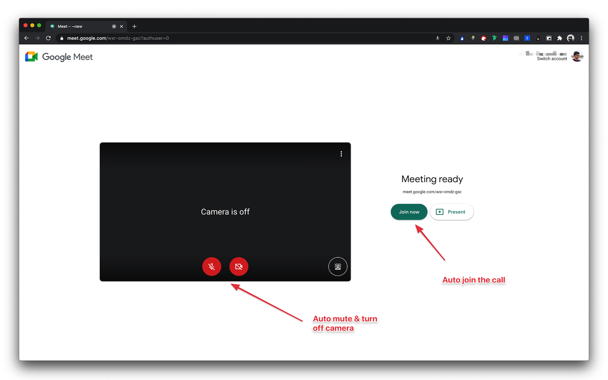
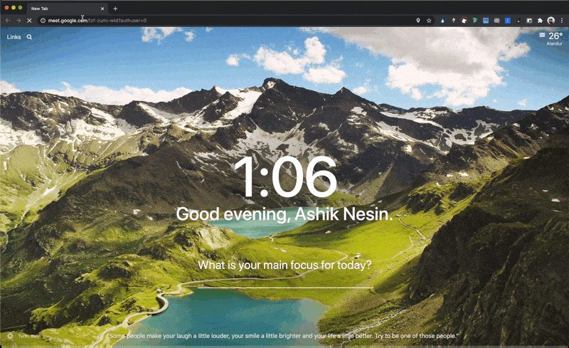
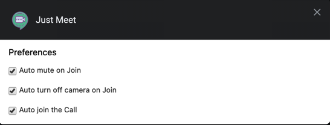

# Just Meet

> Just enhance your Google Meet Experiences

## Features
- Auto mute on Join
- Auto turn off camera on Join
- Auto join the Call
- Easily Configurable

## Roadmap
- [x] Auto join
- [x] Auto mute & turn off web cam
- [ ] Refactoring muting & camera turn off to increase stability
- [ ] Push to talk
- [ ] Auto accept/reject new entrants
- [ ] Hide unread chat message
- [ ] Hide X left/joined message
- [ ] DND mode - Mute sound when receiving new message
- [ ] Confirmation message when turning on web cam during call

## Credits
- Extension Boilerplate based on [browser-extension-template](https://github.com/notlmn/browser-extension-template)
- Extension icon made by [Icons8](https://icons8.com/icon/6GXiHvXGq8VF/google-meet)

## Install
You can install it from the [Chrome Web Store](https://chrome.google.com/webstore/detail/just-meet/hkheplanjmdcfhodikenfkgceffndbgj)

## License
MIT © [Nesin Technologies LLP](https://nesin.io)
